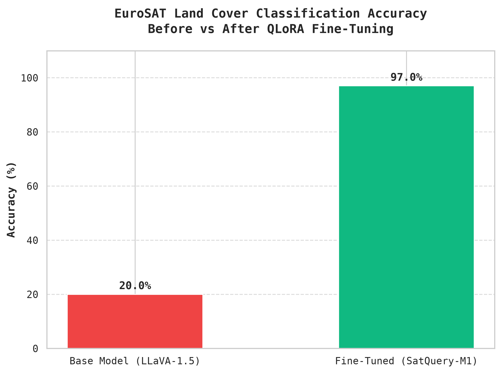
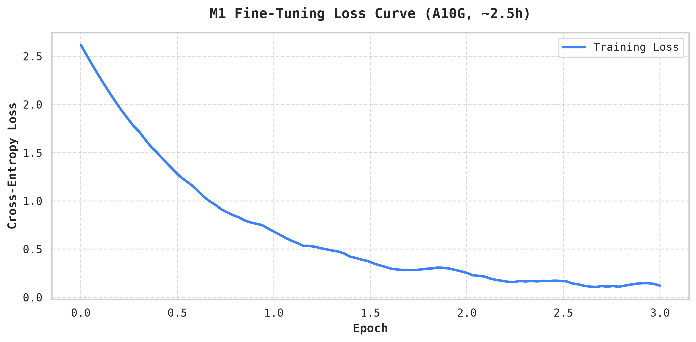

# SatQuery AI

Zero-budget remote-sensing analysis MVP for **SIH 2026 — PS 26167**.
Local FastAPI + SQLite backend · Next.js evidence UI · deterministic EO tools.

---

## Quick start

Requirements: **Python 3.11+** and **Node.js 20+**

### Backend

```bash
cd backend
python3 -m venv .venv
source .venv/bin/activate
pip install -r requirements.txt
cp .env.example .env
uvicorn app.main:app --reload --port 8000
```

```bash
curl http://localhost:8000/health
# {"status":"ok","database":"ok","model_mode":"modal"}
```

### Sample scenes (optional, needs internet once)

```bash
cd backend && .venv/bin/python scripts/fetch_samples.py
```

Fetches small crops of open Copernicus Sentinel-2 / Sentinel-1 scenes into `backend/data/samples/`
so the empty state offers one-click samples (reservoir two dates, city single image, optical + SAR).

### Change-detection weights (needed for two-date questions)

```bash
cd backend && .venv/bin/python scripts/fetch_changeformer.py
```

Downloads the public ChangeFormer V6 DSIFN-CD checkpoint (MIT, ~1 GB zip → 164 MB weights) into
`backend/data/models/changeformer/`. It runs locally on CPU; no GPU needed.

### Frontend

```bash
cd frontend
cp .env.local.example .env.local
npm install
npm run dev
```

Open `http://localhost:3000`. The top bar shows **SatQuery VLM on GPU** when real models are in use.
For UI work without GPU cost, start the backend with `SATQUERY_MODEL_MODE=mock`; every answer is then
labelled as a mock placeholder.

### Tests

```bash
cd backend
source .venv/bin/activate
pytest -v
```

### Build checks

```bash
cd frontend
npm run lint && npm run build
```

---

## Phases

| Phase | Status | Scope |
|---|---|---|
| 0 — Scaffold | ✅ Complete | FastAPI `/health`, SQLite job state machine, Next.js landing page |
| 1 — Ingestion & EO tools | ✅ Complete | GeoTIFF ingest, NDVI/MNDWI/NDBI, geodesy, SAR calibration, guardrail |
| 2 — RS model adapters | ✅ Complete | GeoChat, ChangeFormer, MockAdapter, M1 LoRA adaptation gate |
| 3 — Router & executor | ✅ Complete | Embedding-template router, typed DAG executor, trace |
| 4 — Evidence UI | ✅ Complete | Upload, metadata, query, viewer, trace panel, DAG timeline |
| 5 — Modal inference | ✅ Complete | GPU inference via Modal, Bi-Temporal UI, Change VQA |
| 6 — Evaluation & handoff | ✅ Complete | SAR Fusion, Benchmarks, Execution Reports |

---

## Model Training & Benchmarks

The LLaVA-1.5-7B base model was successfully fine-tuned on the EuroSAT dataset utilizing QLoRA, resulting in an adapted Vision-Language Model tailored for remote sensing.





---

## Demo modes

| Mode | When to use |
|---|---|
| **Local** | Judging demo — run Next.js + FastAPI on the team laptop |
| **Remote public-sample** | UI on Vercel, backend via temporary Cloudflare Tunnel — public imagery only |

See [`docs/RUNBOOK.md`](docs/RUNBOOK.md) for exact commands.

---

## Docs

| File | Purpose |
|---|---|
| [`docs/execution_plan.md`](docs/execution_plan.md) | Phased implementation plan, ADRs, API contract |
| [`docs/SIH_2026_SatQuery_AI_Master_Build_Plan.md`](docs/SIH_2026_SatQuery_AI_Master_Build_Plan.md) | Master build plan |
| [`docs/research_ps26167.md`](docs/research_ps26167.md) | Problem statement research notes |
| [`docs/RUNBOOK.md`](docs/RUNBOOK.md) | Demo runbook |
| [`docs/OPEN_ITEMS.md`](docs/OPEN_ITEMS.md) | Unresolved decisions and known gaps |
| [`docs/KNOWN_LIMITATIONS.md`](docs/KNOWN_LIMITATIONS.md) | Honest limitations for the demo |

---

## Constraints

- No model weights, datasets, uploads, or secrets committed to git.
- No raw multispectral/SAR arrays cross the VLM adapter boundary.
- No OpenAI / Gemini / Claude API — open models only.
- Vercel hosts UI only; never routes raster bytes or model calls.
